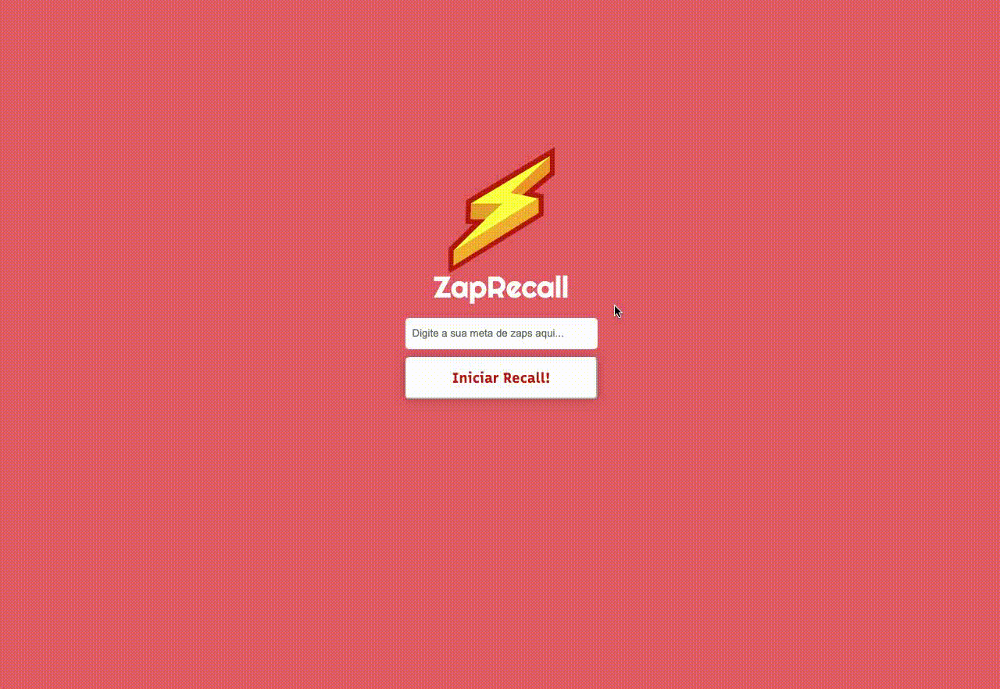

<h3>Relembre conceitos de JavaScript com ZapRecall<h3/>

## Tecnologias

Algumas tecnologias usadas:

- ReactJS

## Serviços

- Github
- Vercel

## Como usar ?

  
  <h4>Se tiver alguma meta de Zap, adicione e Inicie o recall...</h4>

 

  
  <h5>Responda as perguntas, Lembre-se não lembrar de alguma resposta acarreta na falha de desempenho, seja o melhor!</h5>

 

  
  
  <h5>Obtenha seu resultado e trabalhe para sempre estar antenado sobre conceitos de JavaScript.</h5>

## Recursos

- Layout Responsivo 📱
- Metas de Acertos ✅
- FeedBack de desempenho 📈

## Links

- Deploy Vercel: ***https://zap-recall-lyart.vercel.app/***
- Repositório: ***https://github.com/Pedro-Hen46/ZapRecall***

## Autores

- **Pedro Henrique dos Santos Silva**

---

   
  
  Me siga no [**Github**](https://github.com/login?return_to=https%3A%2F%2Fgithub.com%2FPedro-Hen46) e Faça uma conexão no [**LinkedIn**](https://www.linkedin.com/in/pedro-henrique-dos-santos-silva-05012289) ❤

Obrigado por visitar.
